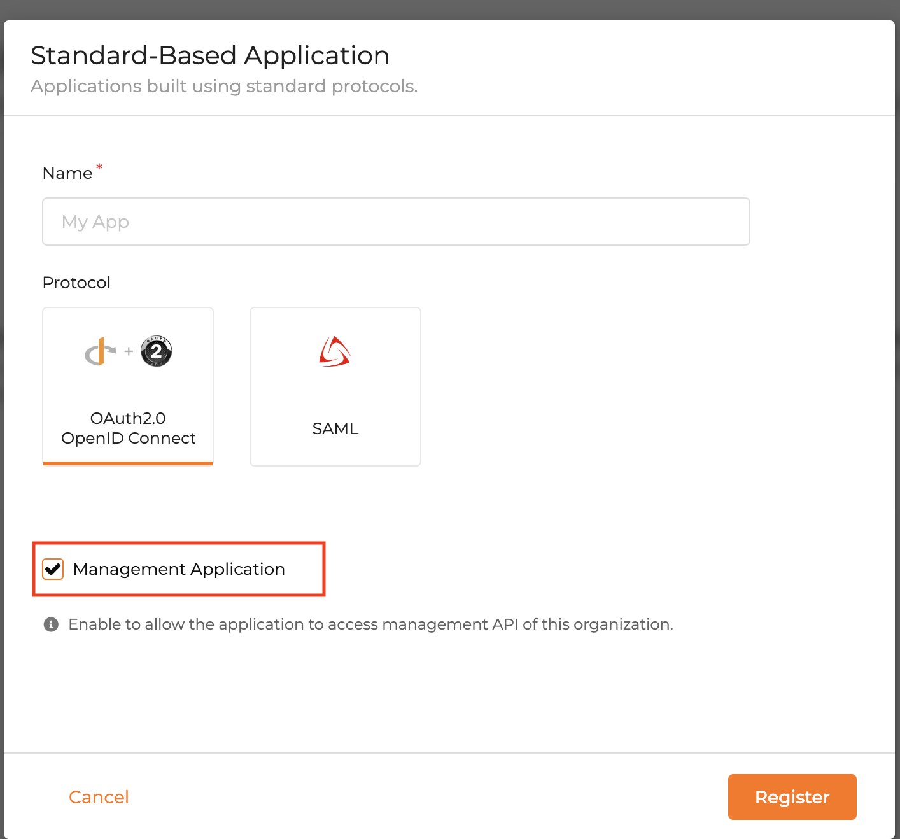

# Kfone Admin Backend

## Installation

### Requirements
1. Python 3.9 or higher

### Setup
1. Clone the repository
2. Navigate to the kfone_admin_backend directory
3. Run `pip install -r requirements.txt` to install the required packages

### Setup the Asgardeo
1. Login to your Asgardeo account.
2. Create a new Standard-Based Application in the Asgardeo Console. https://wso2.com/asgardeo/docs/guides/applications/register-standard-based-app/#register-an-application (Make sure you select the Management Application option)

3. Make sure that you have enabled the Client_Credentials grant type once the application registration completed.
4. Create the following user groups,
   - admin
   - sales
   - marketing
   - customer
5. Create another Asgardeo application for the mobile app (TODO)

### Setup the application
1. Navigate to the kfone_admin_backend directory and open the `resources/config.ini` file.
2. Set the following values for each properties,
    - ADMIN_CLIENT_ID: The client id of the Asgardeo Management Application
    - ORGANIZATION: The organization name of the Asgardeo Management Application
    - CUSTOMER_GROUP_ID: The id of the customer group that created in previous step 
    (To get the id, you need to open the network tab of the browser and navigate to the Asgardeo Console and click on the customer group. The id will be in the url)
3. Get the client id and add it to the `ADMIN_CLIENT_ID` variable in the `resources/config.ini` file.
4. Get the client secret and set it as an environment variable with the name `ADMIN_CLIENT_SECRET`.
 `EXPORT ADMIN_CLIENT_SECRET=<client_secret>`
5. Finally, get the organization and add it to the `ORGANIZATION` variable in the `resources/config.ini` file.
6. TODO: Add the Audience

### Host the application (Using https://fly.io/)
1. You can follow the instructions in [this](https://fly.io/docs/languages-and-frameworks/python/) document to simply host this application in the fly.io platform.
2. Make sure to add the `ADMIN_CLIENT_SECRET` environment variable in the fly.io dashboard. https://fly.io/docs/reference/secrets/#setting-secrets
```flyctl secrets set ADMIN_CLIENT_SECRET="<cleint_secret>"```


